# 🛡️ LARP: AI-Driven EDR / XDR Manager


# LAN Active Response Platform (LARP)

LARP is an **Agent–Manager cybersecurity platform** for small and medium enterprises (SMEs). It provides real‑time endpoint monitoring, behavioral risk assessment, automated incident response, and network topology management.

The system consists of three main components:

- **Manager** – FastAPI backend, PostgreSQL database, WebSocket server.
- **Agent** – lightweight Python client running on each protected machine.
- **Frontend** – React (Vite) dashboard for SOC operators and administrators.

---

## Table of Contents

1. [Architecture Overview](#architecture-overview)
2. [Project Structure](#project-structure)
3. [Key Features](#key-features)
4. [Screenshots](#screenshots)
5. [Getting Started](#getting-started)
6. [API Documentation](#api-documentation)
7. [Testing](#testing)
8. [Technologies Used](#technologies-used)

---

## Architecture Overview

LARP follows a **layered architecture** with clear separation of concerns:
Agent (Python) <--WebSocket--> Manager (FastAPI) <--REST/WebSocket--> Frontend (React)
|
PostgreSQL DB

text

### Manager (backend)

The Manager is built with **FastAPI**, **SQLAlchemy 2.0 (async)**, and **Pydantic v2**. It exposes:

- REST API under `/api/v1`
- WebSocket endpoints:
  - `/ws/agent` – communication with agents (heartbeat, telemetry, command dispatch)
  - `/ws/dashboard` – real‑time updates for the frontend
- Background scheduler for dead‑agent detection and periodic risk assessment

The backend is organized into:

- `models/` – SQLAlchemy entities
- `schemas/` – Pydantic DTOs
- `repositories/` – data access layer
- `services/` – business logic (risk engine, command dispatcher, topology manager, incident service, etc.)
- `routers/` – API endpoints
- `websocket/` – WebSocket handlers

### Agent (client)

Each protected machine runs an Agent – a lightweight Python script (`agent.py`). The Agent:

- Sends **heartbeats** (CPU, RAM, disk, IP, MAC)
- Sends **telemetry** (process list, network connections, file changes)
- Listens for **commands** from the Manager (isolate, kill process tree, quarantine, self‑update)
- Executes response actions locally (iptables, process termination)

Agent commands are modular, located in `agent/commands/`.

### Frontend

The frontend is built with **React 19**, **Vite**, and **Chart.js**. It provides a complete SOC dashboard with:

- Real‑time KPI cards
- Agent management (isolate, unisolate, history)
- Alerts & Incidents
- 3D Network Topology
- Risk Assessment Monitor
- Detection Rules Engine
- Threat Intelligence lookup
- Process Tree & Root Cause Analysis
- Reports, Whitelist, Notifications, Settings

---

## Project Structure
```
larp/
├── agent/ # Lightweight Python agent
│ ├── agent.py
│ ├── commands/ # Command handlers (isolate, kill_tree, quarantine...)
│ ├── malware_sim/ # Malware simulation scripts for testing
│ ├── Dockerfile
│ └── requirements.txt
│
├── attacker/ # Optional attacker container (SYN flood tool)
│ └── scripts/syn_flood.sh
│
├── frontend/ # React frontend
│ ├── src/
│ │ ├── api/ # Axios API services
│ │ ├── components/ # Reusable UI components
│ │ ├── hooks/ # Custom React hooks
│ │ ├── pages/ # Page components
│ │ └── ...
│ ├── Dockerfile
│ ├── package.json
│ └── vite.config.js
│
├── manager/ # FastAPI backend
│ ├── app/
│ │ ├── core/ # Configuration, database, exceptions
│ │ ├── models/ # SQLAlchemy models
│ │ ├── schemas/ # Pydantic DTOs
│ │ ├── repositories/ # Data access
│ │ ├── services/ # Business logic & risk engine
│ │ ├── routers/ # API routes
│ │ └── websocket/ # WebSocket endpoints
│ ├── tests/ # Integration tests
│ ├── Dockerfile
│ ├── requirements.txt
│ └── ...
│
├── asset/ # Screenshots used in this README
├── docker-compose.yml
└── README.md
```

---

## Key Features

- **Real‑time Agent Monitoring** – CPU, RAM, disk, last seen, and status.
- **Behavioral Risk Assessment** – 13 detection rules evaluate telemetry and return a risk score (0–100).
- **Automated Response** – isolate agent, kill process tree, block IP, quarantine.
- **Incident Management** – create, assign, contain, resolve, false‑positive, close incidents.
- **Dynamic Detection Rules** – enable/disable, adjust weight and base score per rule.
- **Threat Intelligence** – check IP, domain, hash against known malicious indicators.
- **Process Tree Analysis** – visualize parent‑child process hierarchy, kill process tree.
- **3D Network Topology** – Dijkstra‑based path finding with bandwidth constraints.
- **Notifications** – Discord/Telegram webhook alerts.
- **Reports** – generate PDF security reports.
- **Whitelist** – exclude trusted processes/paths from automatic isolation.
- **Settings** – configure risk thresholds, file change thresholds, auto‑response.

---

## Screenshots

### 1. Dashboard
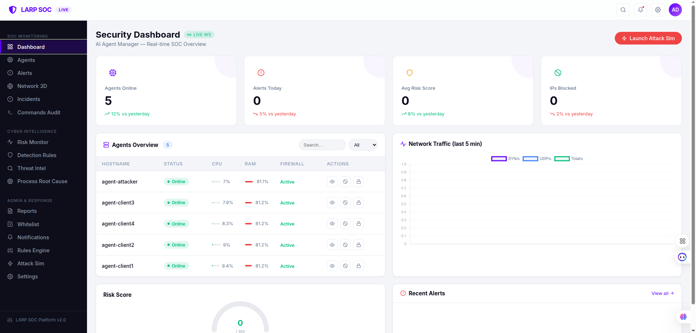

The main dashboard provides a real‑time overview: KPI cards, network traffic chart, agent list, and recent alerts.

---

### 2. Agents Management
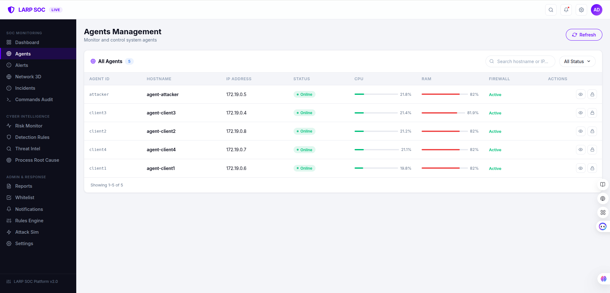

View and manage all connected agents. Search, filter, isolate or release agents.

---

### 3. Agent Detail – Overview
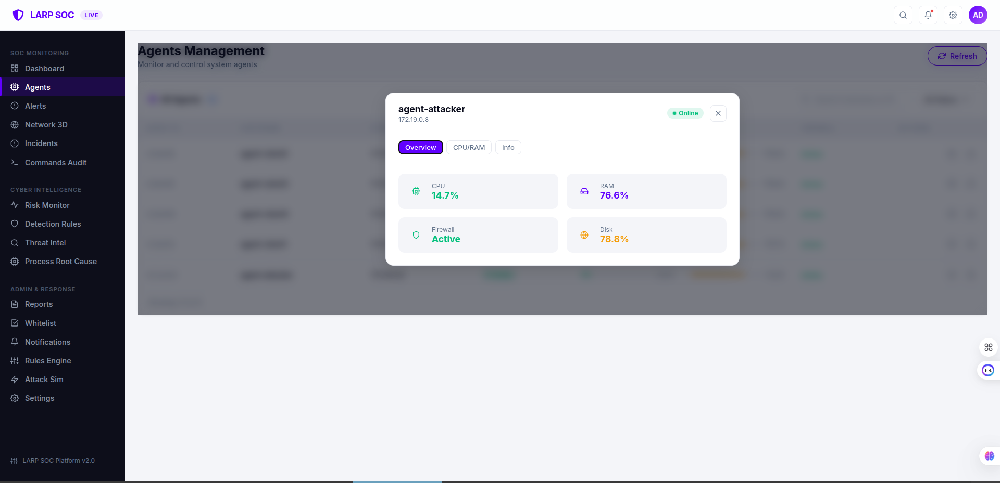

Detailed information about a single agent, including CPU, RAM, disk, firewall status.

---

### 4. Agent Detail – History (CPU/RAM)
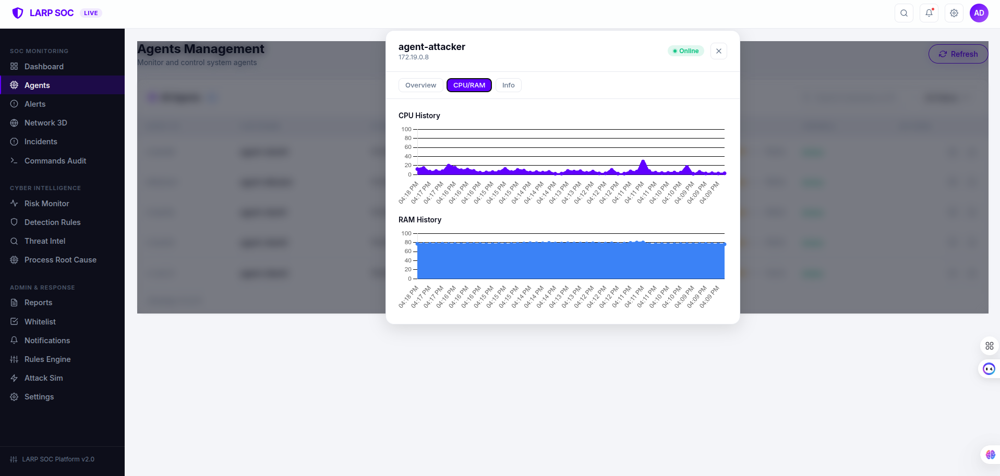

Historical CPU and RAM usage charts for an agent.

---

### 5. Alerts / Events
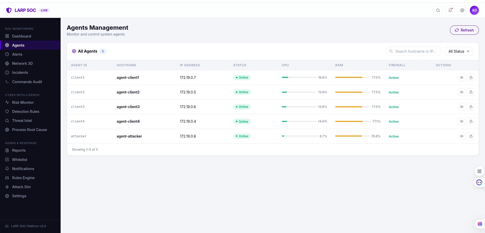

List of security alerts with severity and search/filter capabilities.

---

### 6. Incidents Management
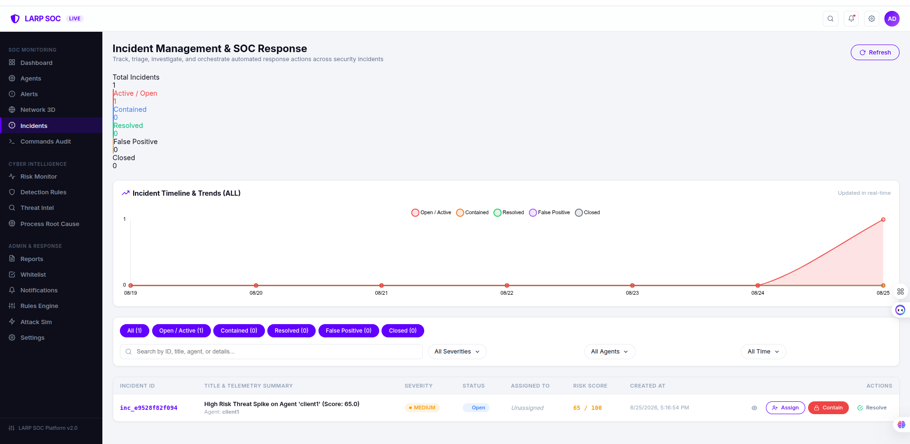

Full incident lifecycle management: assign, contain, resolve, false positive, close.

---

### 7. Network Topology 3D
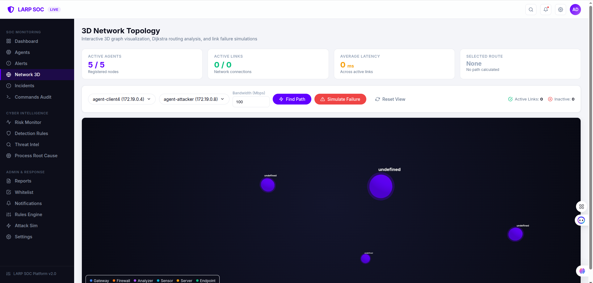

Interactive 3D graph of the network. Find shortest path with bandwidth requirements.

---

### 8. Risk Assessment Monitor
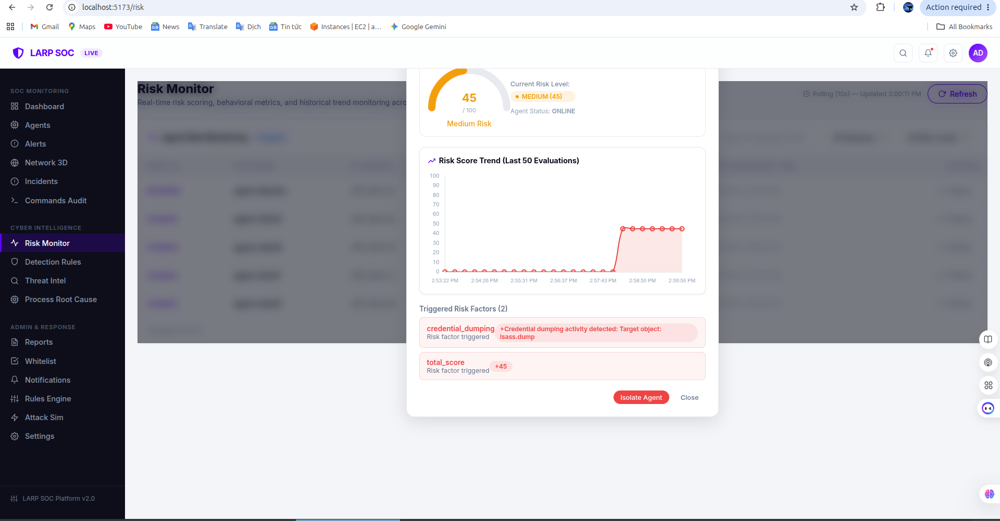

Monitor risk scores for all agents. View historical risk trends and triggered factors.

---

### 9. Detection Rules Engine
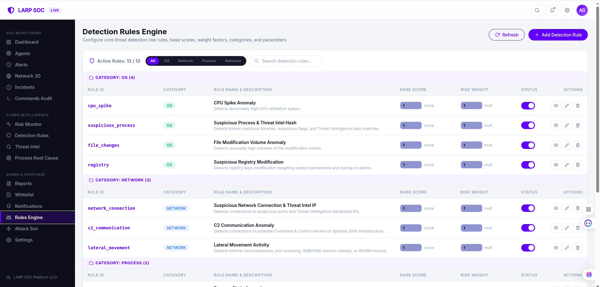

Manage 13 behavioral detection rules. Enable/disable, adjust weight and base score.

---

### 10. Process Tree & Root Cause Analysis
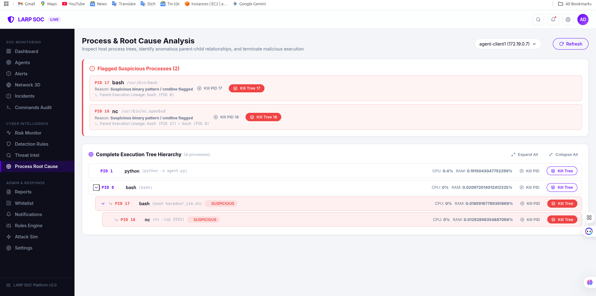

Visualize process hierarchy, identify suspicious processes, and kill process trees.

---

### 11. Threat Intelligence
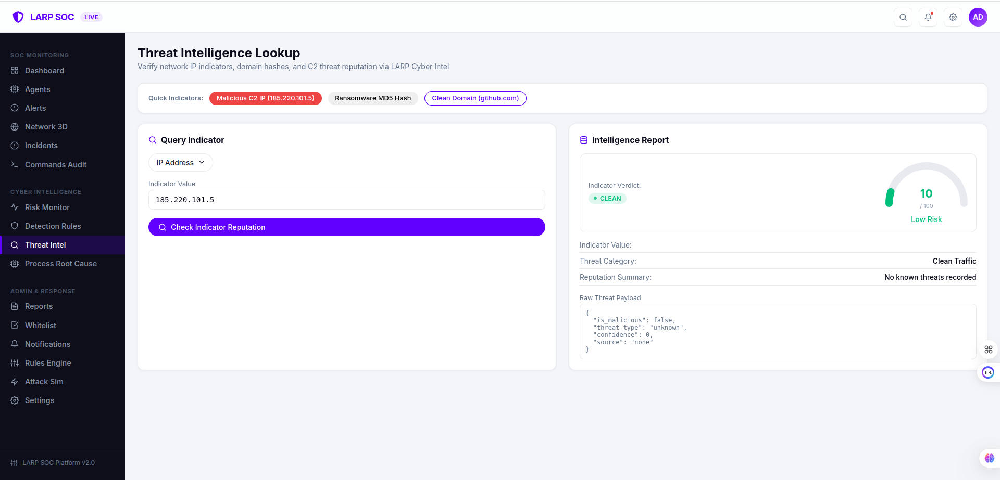

Look up IP, domain, or hash reputation.

---

### 12. Notifications
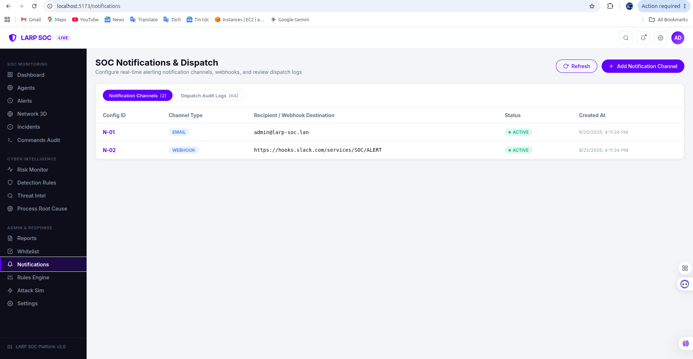

Configure notification channels (Discord, Slack, Telegram) and view audit logs.

---

### 13. Reports
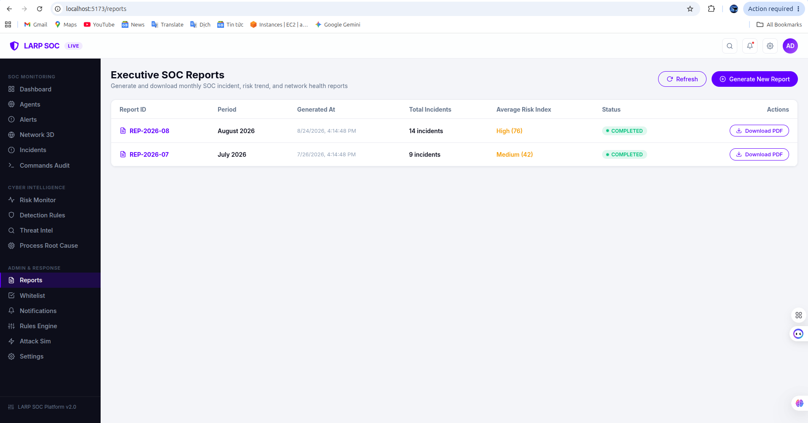

Generate and download PDF security reports.

---

### 14. Whitelist
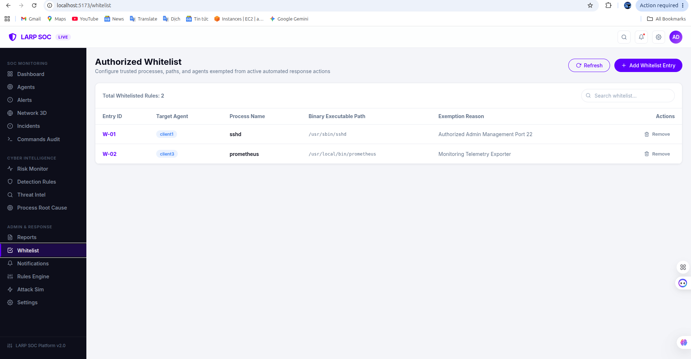

Add trusted processes or paths to avoid false‑positive isolations.

---

### 15. Settings
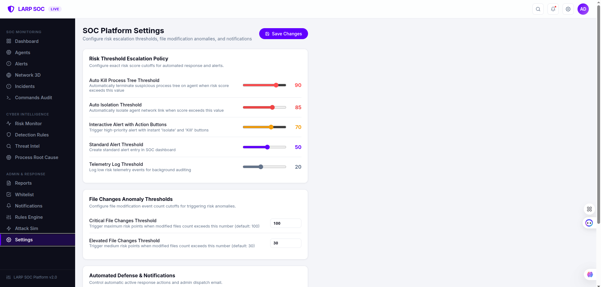

Adjust risk escalation thresholds, file change thresholds, and automation settings.

---

## Getting Started

### Prerequisites

- Docker & Docker Compose
- Node.js 20+ (for frontend development)
- Python 3.12 (for backend development)

### Quick Start with Docker Compose

1. **Clone the repository**

   ```bash
   git clone https://github.com/conbobi/lan-active-response-platform.git
   cd larp
Start all services

bash
docker-compose up --build
This will start:

PostgreSQL database (port 5432)

Manager backend (port 8002)

Four simulated agents (client1–client4)

Attacker container (for testing)

Access the frontend

Open http://localhost:5173 (or the port mapped in vite.config.js).

Access the API documentation

Open http://localhost:8002/docs for Swagger UI.

Run malware simulation scripts (for testing)

bash
docker-compose exec client1 bash /app/malware_sim/backdoor_sim.sh &
Or any other script in /app/malware_sim/.

API Documentation
The backend exposes a comprehensive REST API under /api/v1. Main endpoint groups:
```
Group	Endpoints
Agents	/agents, /agents/{id}, /agents/{id}/isolate, /agents/{id}/unisolate, /agents/{id}/history
Incidents	/incidents, /incidents/{id}, /incidents/{id}/assign, /incidents/{id}/contain, /incidents/{id}/resolve
Risk Assessment	/risk/evaluate, /risk/{agent_id}/history
Detection Rules	/rules/detection, /rules/detection/{rule_id}
Topology	/topology/links, /topology/update, /path/request, /path/release
Process	/process/{agent_id}/tree, /process/{agent_id}/suspicious, /process/{agent_id}/kill
Threat Intel	/threat-intel/check
Notifications	/notifications/configs, /notifications/logs, /notifications/webhook/discord
Reports	/reports, /reports/generate, /reports/{report_id}/download
Whitelist	/whitelist, /whitelist/{entry_id}
Settings	/settings, /settings/risk_thresholds, /settings/file_changes_thresholds
Full OpenAPI specification is available at /docs or /openapi.json.
```

Testing
Backend tests are written with pytest and can be run from the manager/ directory:

bash
cd manager
python -m pytest
The test suite includes unit tests for services, integration tests for API endpoints, and WebSocket tests.

Technologies Used
Backend: Python 3.12, FastAPI, SQLAlchemy 2.0, Pydantic v2, asyncpg, Uvicorn, WebSockets

Frontend: React 19, Vite, Chart.js, React Router, Axios, react‑force‑graph‑3d

Database: PostgreSQL 16

Containerization: Docker, Docker Compose

Testing: pytest, pytest‑asyncio, httpx

